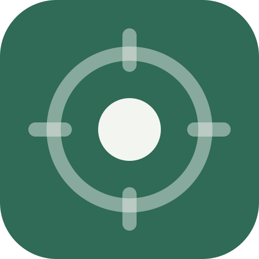
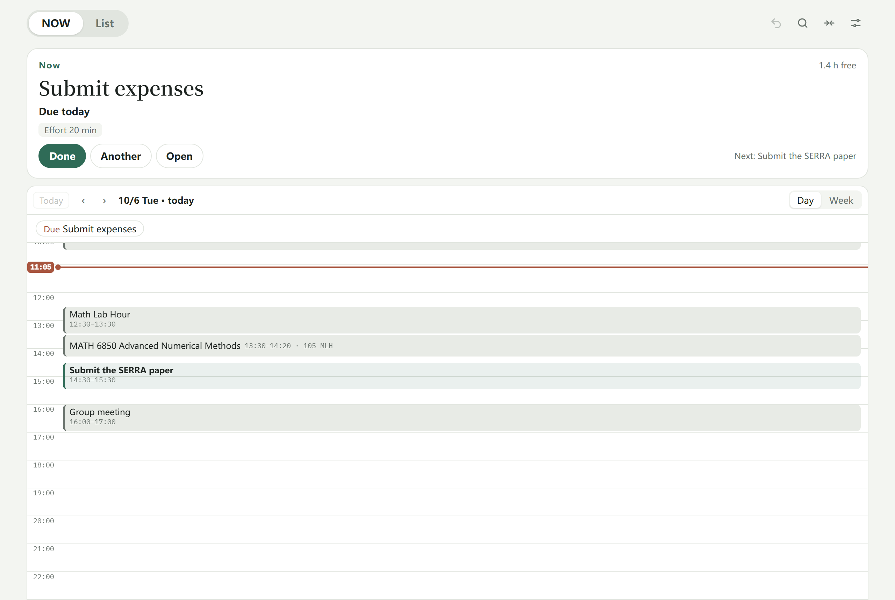
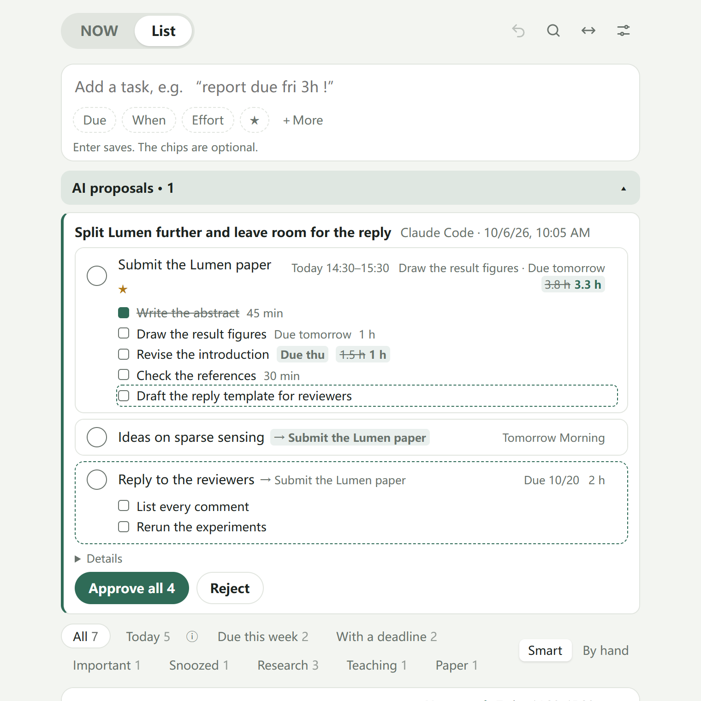
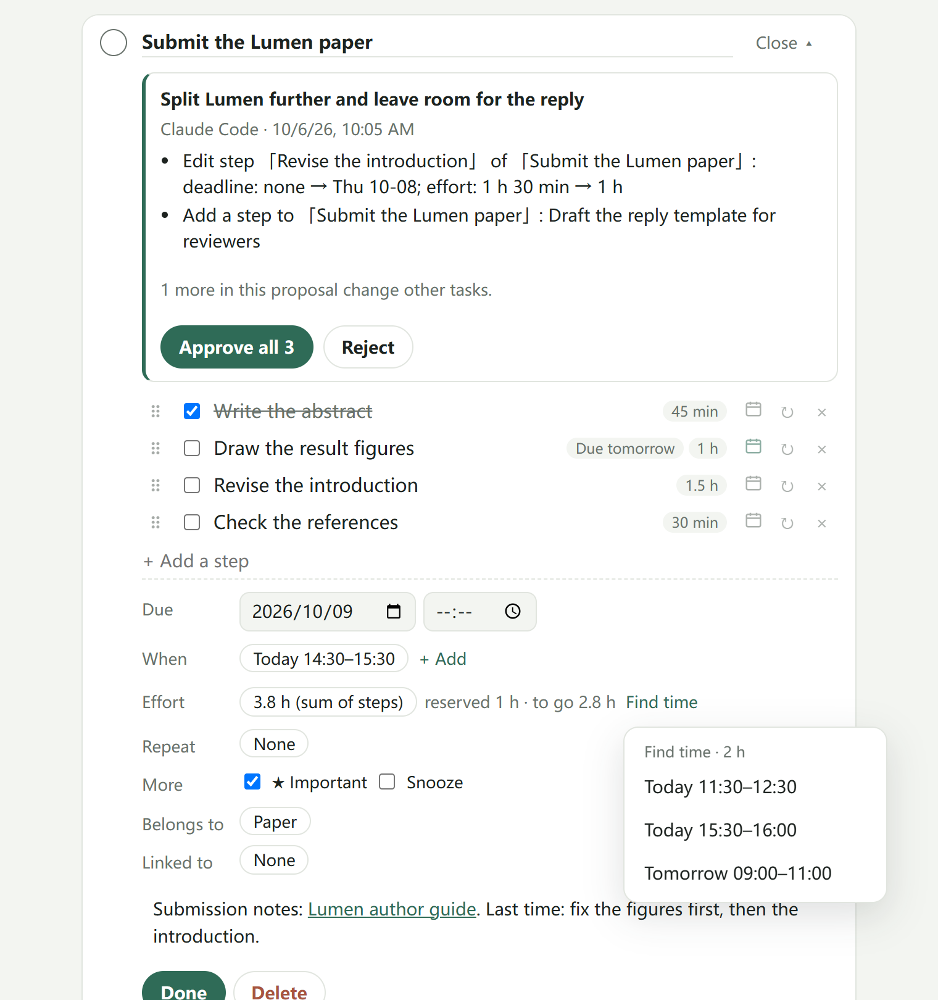

<div align="center">



# Attention Planner

English · [简体中文](README.zh-CN.md)

**A to-do list that plans itself. You write things down and do them; it remembers, orders and reminds — and your AI can plan with you.**


[Why](#why-attention-planner) · [With your AI](#working-with-your-ai) · [Highlights](#highlights) · [Use it](#use-it) · [User guide (Chinese)](docs/user-guide.md) · [How the parts interact](docs/interactions.md)

</div>



## Why Attention Planner

Your attention is the scarce thing, not your tasks. Between chats, feeds, mail and AI windows, the cost of a to-do
list is rarely writing something down; it is deciding, again and again, what to look at now. Attention Planner is built
to make that decision for you, so you can **gather your attention on one thing, switch cleanly, and come back**.

**Write it down, then let go.** One line, Enter, done: `周五交报告 3小时 !` or `report due fri 3h !`. There is no
inbox to process, no weekly review, no status to keep up to date. Nothing you change ever makes a task "move
somewhere else": there is one list.

**It keeps itself, so you do not have to.** The most tiring part of a traditional to-do list is the upkeep. Here a
weekly checklist reopens by itself, each step can keep its own rhythm, a deadline moves with every round, a snoozed
task comes back when its deadline arrives, and reminders reach your phone even with the app closed. Habits are tasks
too: write `每天 看邮件` or `every mon and thu gym` and it simply comes round again.

**One thing now, and why.** NOW shows a single suggestion with its reason — a reserved time that is happening, a part
of the day that has begun, something overdue or due today, something marked important — with today's agenda under
it. "Another" cycles to the next. Only the present is computed; the future stays light.

**Only deadlines put on pressure.** Plans and reserved times are intentions, not promises. With an estimate, the app
checks whether the work due by each deadline still fits the free working time before it, and says so if it does not.

**Your AI, in both directions.** Through MCP, ChatGPT, Claude and other assistants can read your list and agenda and
ask what should happen next, so the plan can steer the AI's work. And the other way round: from the context of
whatever you are working on, the AI can draft tasks and break a big, vague one into concrete steps — as proposals you
approve in the app. For anyone who stalls in front of a task that is too large and too abstract (hello, ADHD and
procrastination), the thinking-it-into-steps part is no longer yours to do; you only follow the next step.

Since most AI assistants take voice, the whole chain can run without typing: the AI listens to a meeting or a
conversation, calls the MCP tools, and the action items arrive in your list already broken into steps, with deadlines
and estimates — waiting for one tap.

**Yours, and private.** Data lives on your devices and in your own Google Drive's hidden app folder. Edits from two
devices merge field by field; concurrent edits to the same text keep both versions until you choose. The push service
only ever sees an opaque id and a time.

## Working with your AI



1. In the AI client, add the MCP server `https://todo.onthat.top/api/mcp` (it is also in Settings → AI connections).
   For Claude Code:

   ```bash
   claude mcp add --scope user --transport http attention-planner https://todo.onthat.top/api/mcp
   ```

2. Allow it in the browser page that opens: reading, and (if you want) adding tasks and proposing changes.
3. Talk to it — typing, or by voice in an assistant that listens. New tasks and changes arrive as a proposal (new
   tasks can be saved at once instead, in Settings): the list shows "AI 提议", the affected task shows before → after, your devices get a
   notification, and one tap approves (undoable) or rejects.

The hands-free loop: **record a meeting or talk it through → the AI turns it into tasks and steps over MCP → you
approve on your phone → NOW tells you the first step.**

Things to ask:

```text
What should I do now? Plan my afternoon around my calendar.
Break "submit the Lumen paper" into steps of under an hour, each with an estimate, and find time for the first one.
From this meeting's notes, add the action items for me, due Friday.
Link "Lumen submission" to the Research task and make the weekly lab notes reopen every Monday.
```

The tools: `what_now`, `list_tasks`, `get_task`, `agenda`, `find_time`, `list_areas_and_projects` (read);
`add_task` (approved, or saved at once if you choose; with the app's quick words, links and repeats); `propose_changes` (fields, steps, plans,
links, repeats, projects — approved in the app); `get_proposal`. Details in
[docs/ai-connections.md](docs/ai-connections.md).

## Highlights

### Capture in one line, the way you would say it

Type what you would say: dates, times, parts of the day, lengths, importance and repeats are recognised and shown as
chips under the box, in the order that matters (deadline → when → effort → importance). Tap a chip to undo it.

| You type                                     | It understands                                 |
| -------------------------------------------- | ---------------------------------------------- |
| `周五交报告 3小时 !` · `report due fri 3h !` | due Friday, 3 hours, important                 |
| `明天下午 写周报` · `tomorrow at 7pm call`   | when to do it (a day, a part of it, or a time) |
| `每天 看邮件` · `every mon and thu gym`      | a repeat that reopens in place                 |
| `每周五交周报`                               | due next Friday, a new copy every week         |
| `10月20日` · `10/20` · `月底` · `Oct 20`     | a date written out (the next such day)         |

### Repeats that maintain themselves

A task can **reopen in place** (a weekly checklist that clears its steps each round and keeps a history) or create a
**new copy** when you finish (deadlines, plans and step deadlines move along). Each step can follow the task, never
reset, or keep a rhythm of its own. A round is done only when every open step is. Dates belong to the round: a list
due the day after it opens is due the day after every time, never "overdue by 7 days".

### Steps that make a big task concrete



Steps come first in an opened task. Each can have its own deadline (the earliest open one is shown everywhere), its
own estimate (they add up), and its own repeat; one can become a task of its own. The step box reads the same quick
words: `周五 交初稿 30分钟`.

### NOW and the agenda

The one thing to do now, with the reason, the facts that matter and the next step; under it, today's agenda — Outlook
(via a Google Drive export), subscribed calendars (`.ics` or `webcal://`) and your reserved times — in a fixed-scale
day that opens at the current time, with overlapping items side by side. Tap empty time to reserve it; the tasks that
suit that gap are suggested first.

### Find time

Beside the estimate, **Find time** offers free working time before the deadline, around your calendar and other
reservations, each as long as what is still to reserve (up to two hours, so a long job comes in pieces). One tap
reserves it. Reserving never changes the estimate: the estimate is how much work there is; a reservation is only an
intention.

### Everything else

| Capability              | Details                                                                                                                                                                                                                                  |
| ----------------------- | ---------------------------------------------------------------------------------------------------------------------------------------------------------------------------------------------------------------------------------------- |
| Is there time?          | With estimates, every deadline is checked against the free working time before it.                                                                                                                                                       |
| Snooze                  | Replaces "waiting", "someday" and "not before"; a deadline that arrives brings the task back.                                                                                                                                            |
| Areas and projects      | Group the list; a project can go one task after another (repeating tasks stay out of the queue).                                                                                                                                         |
| My Day and filters      | ☀ on a row (or `T`, or a swipe on a phone) adds it to today; yesterday’s leftovers are offered, never moved. Filters: today, due this week, with a deadline, important, new, unplanned, snoozed, each area and project — you pick which. |
| Capture from anywhere   | `todo.onthat.top/?add=…` links and bookmarks, the Android share sheet, and a personal link for an iPhone Shortcut — so “Hey Siri, note it” works without opening the app.                                                                |
| Search and keyboard     | `/` or `Ctrl+K` searches titles, notes and steps; `N` captures; `Ctrl+Z` undoes anything; `Ctrl+S` syncs.                                                                                                                                |
| Reminders               | Push notifications on a deadline's day, a step's deadline, before reserved times and when an AI proposes changes, app closed or not.                                                                                                     |
| Offline and installable | A PWA for iPhone home screens and desktops; data in IndexedDB on the device.                                                                                                                                                             |
| Sync                    | Google Drive app folder, merged field by field; two versions of the same text are kept until you choose.                                                                                                                                 |
| Goal                    | An optional long-term goal in your own words: the AI keeps it as the longest context; NOW can show it, quietly (off by default).                                                                                                         |
| Comfort                 | Chinese and English, light and dark, full width on large screens, respects reduced motion.                                                                                                                                               |

## Use it

Open [todo.onthat.top](https://todo.onthat.top), then **Add to Home Screen** on iPhone (iOS 16.4+ for notifications)
or **Install** in a desktop browser. To sync, open Settings → Sync → Connect and sign in to Google; your data goes to a
hidden app folder in your own Drive. Reminders: Settings → Reminders.

## Getting started

| Where    | Do                                                                                                                 |
| -------- | ------------------------------------------------------------------------------------------------------------------ |
| List     | Type a line and press Enter. Tap a title to open it in place; the circle completes it.                             |
| NOW      | Do the one thing shown, or tap "another". Day / week switch the agenda; tap an item for details.                   |
| A task   | Steps first, then deadline, when, effort (with Find time), repeat, snooze, area or project, link, note (Markdown). |
| Settings | Working hours, capture chips, list filters, step buttons, reminders, calendars, sync, AI connections.              |

More in the [user guide](docs/user-guide.md) (Chinese), [how the parts interact](docs/interactions.md) and
[the design notes](docs/design.md).

## Development

```bash
npm install
npm run dev
```

TypeScript, React, Vite and a PWA; the model in `src/model` is plain functions over one JSON document. The MCP server
is a Cloudflare Worker in `mcp/`. Tests: Vitest for the model and the Worker, Playwright on desktop, phone and reduced
motion. See [docs/development.md](docs/development.md) and [VERIFICATION.md](VERIFICATION.md).

## License

All rights reserved for now. This repository contains no code from any other application; bundled libraries and their
licenses are listed in [THIRD-PARTY-NOTICES.txt](THIRD-PARTY-NOTICES.txt).
