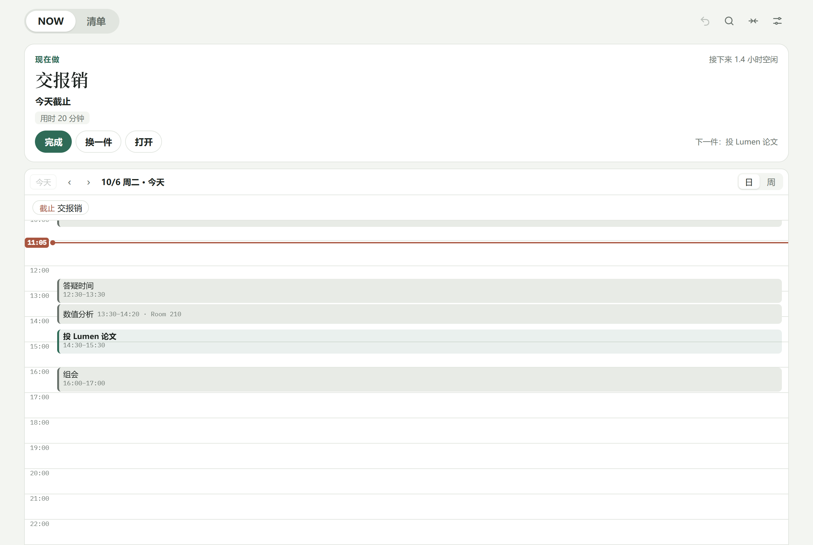
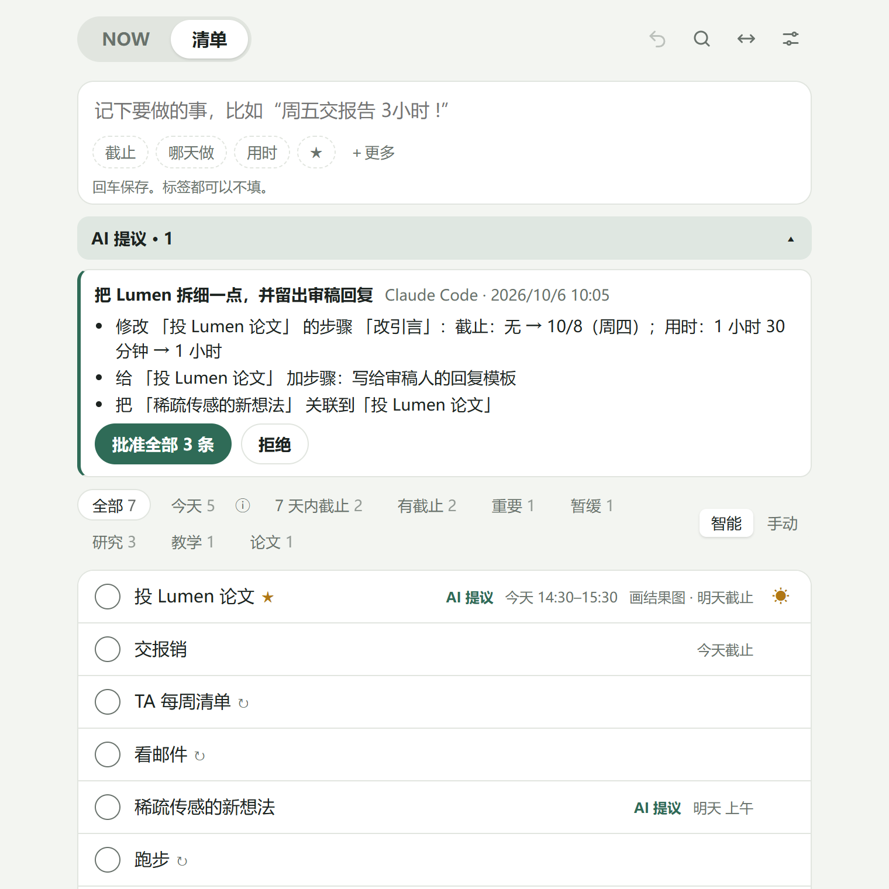
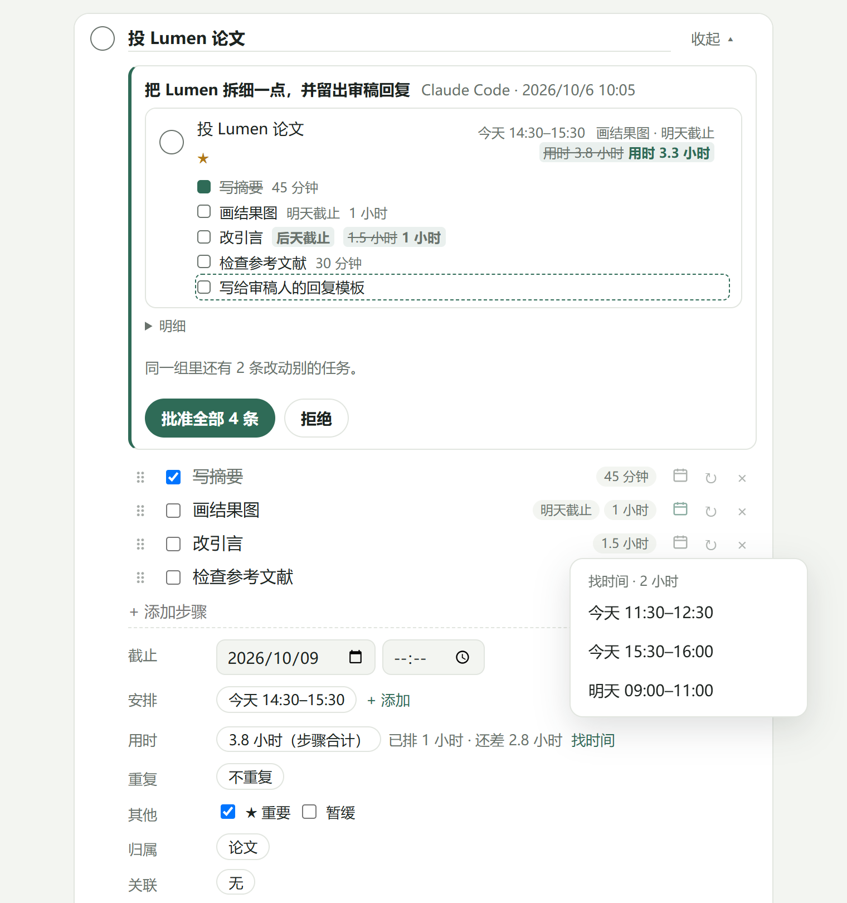

<div align="center">


# Attention Planner 注意力规划

[English](README.md) · 简体中文

**一个会自己规划的待办清单：你只管记下来、去做；记住、排序、提醒交给它——还能和你的 AI 一起规划。**


[为什么](#为什么做-attention-planner) · [和 AI 一起用](#和-ai-一起用) · [亮点](#亮点) · [开始使用](#开始使用) · [使用指南](docs/user-guide.md) · [各部分怎么配合](docs/interactions.md)

</div>



## 为什么做 Attention Planner

稀缺的是注意力，不是任务。在聊天、信息流、邮件和一个个 AI 窗口之间，待办清单真正的成本很少是“记下来”，而是一遍遍决定“现在看哪一个”。乱花渐欲迷人眼，Attention Planner 替你做这个决定，让你**把注意力聚到一件事上，干净地切换，再回来**。

**记下来，然后放下。** 一行字，回车，就好：`周五交报告 3小时 !`。没有收集箱要清，没有每周回顾，没有状态要维护。无论改什么，任务都不会“跑到别处”：只有一张清单。

**它自己维护自己，不用你干苦力。** 传统待办最累人的是维护。在这里，每周的清单会自己重开，每个步骤可以有自己的节奏，截止跟着每一轮走，暂缓的任务到截止会自己回来，应用关着也能收到提醒。习惯也是任务：写 `每天 看邮件`、`每周一三五 跑步`，它就会按时回来——高度可定制的重复与刷新，让提示完全自动化。

**现在只做一件，并且知道为什么。** NOW 只给一个建议和理由——正在进行的预留时段、刚开始的上午/下午、逾期或今天截止的、标了重要的——下面是今天的日程。“换一个”看下一个。它只计算“现在”，未来保持轻量。

**只有截止才带来压力。** 安排和预留的时段只是打算，不是承诺。填了用时，系统会检查每个截止前要做的事放不放得进截止前的空闲工作时间，放不下就告诉你。

**AI 双向嵌入你的工作流。** 通过 MCP，ChatGPT、Claude 等可以读取你的清单和日程，问“接下来该做什么”，让规划反过来指挥 AI 的工作；反过来，AI 也能根据你手上工作的上下文起草任务，把一个又大又抽象的任务拆成具体的步骤——作为待你批准的提议出现在应用里。对 ADHD 和拖延的人来说，最难的往往是面对一个大而抽象的任务时“想清楚怎么拆”；现在这一步可以交给 AI，你只需要照着下一步做。

常见的 AI 都能听语音，所以整条链路可以完全不打字：AI 听完一场会议或一段对话，调用 MCP，待办就已经拆成带截止和用时的步骤，出现在你的清单里，只等你点一下批准。

**数据是你的。** 数据在你的设备上，以及你自己 Google Drive 的隐藏应用文件夹里。两台设备的修改按字段合并；同时改了同一段文字会保留两个版本让你选。推送服务只看得到一个编号和时间。

## 和 AI 一起用



1. 在 AI 客户端里添加 MCP 服务器 `https://todo.onthat.top/api/mcp`（设置 → AI 连接里也有）。Claude Code：

   ```bash
   claude mcp add --scope user --transport http attention-planner https://todo.onthat.top/api/mcp
   ```

2. 在打开的浏览器页面里允许：读取，以及（如果需要）新建任务和提议修改。
3. 直接对它说——打字，或者对能听语音的 AI 直接说。新建和修改都会变成提议（新任务可以在设置里改成立即保存）：清单顶部出现“AI 提议”，被改的任务显示改前 → 改后，你的设备会收到通知，点一下批准（可撤销）或拒绝。

全程不用动手：**录下会议或口述一遍 → AI 通过 MCP 拆成任务和步骤 → 你在手机上批准 → NOW 告诉你第一步做什么。**

可以这样说：

```text
现在该做什么？结合我的日程安排一下下午。
把“投 Lumen 论文”拆成每步不超过一小时的步骤，填上用时，再给第一步找个时间。
根据这次会议记录，把我的待办加进去，周五截止。
把“Lumen 投稿”关联到 Research，并把每周组会笔记设成每周一重开。
```

工具：读取类 `what_now`、`list_tasks`、`get_task`、`agenda`、`find_time`、`list_areas_and_projects`；`add_task`（等你批准或立即保存，支持快捷写法、关联和重复）；`propose_changes`（字段、步骤、安排、关联、重复、项目，在应用里批准）；`get_proposal`、`list_proposals`、`withdraw_proposal`（AI 撤回自己的提议）。详见 [docs/ai-connections.md](docs/ai-connections.md)。

## 亮点

### 一行记下，像说话一样

照你会说的写：日期、时间、上午下午、时长、重要和重复都会被识别，按重要程度显示成输入框下的标签（截止 → 哪天做 → 用时 → ★），点一下就撤掉。

| 输入                              | 识别为                             |
| --------------------------------- | ---------------------------------- |
| `周五交报告 3小时 !`              | 周五截止，3 小时，重要             |
| `明天下午 写周报`                 | 哪天做（某天、上午下午或具体时间） |
| `每天 看邮件` · `每周一三五 跑步` | 原地重开的重复                     |
| `每周五交周报`                    | 截止下一个周五，每周新建一份       |
| `10月20日` · `10/20` · `月底`     | 具体日期（没写年份就是下一个这天） |

### 自己维护的重复

任务可以**原地重开**（每周的清单，每轮清空步骤、保留完成历史），也可以完成时**新建一份**（截止、安排和步骤截止一起顺延）。每个步骤可以跟随任务、永不清空，或者有自己的节奏。所有没做完的步骤都完成，这一轮才算完成。日期属于这一轮：开放后第二天截止的清单，每一轮都是第二天截止，不会“逾期 7 天”。

### 把大任务变具体的步骤



打开任务，最先看到步骤。每一步可以有自己的截止（最早的未完成截止会显示在各处）、自己的用时（自动相加）和自己的重复；一步也可以独立成任务。添加步骤的框认同样的快捷写法：`周五 交初稿 30分钟`。

### NOW 与日程

现在该做的一件事、理由、关键信息和下一步；下面是今天的日程——Outlook（经 Google Drive 导出，见 [Outlook 设置](docs/outlook-setup.md)）、订阅的日历（`.ics` 或 `webcal://`）和你预留的时段——固定比例、打开时停在现在，重叠的并排显示。点空白时间可以预留，最适合这段空档的任务会先被推荐。

### 找时间

用时旁边的“找时间”在截止前的工作时间里找空档，避开日程和别的预留，每段和“还差”的时长一样（最多两小时，长任务分几段）。点一下就预留。预留多少都不会改用时：用时是工作量，预留只是打算。

### 其他

| 能力           | 说明                                                                                                                                                         |
| -------------- | ------------------------------------------------------------------------------------------------------------------------------------------------------------ |
| 时间够不够     | 填了用时，每个截止都会和截止前的空闲工作时间比较。                                                                                                           |
| 暂缓           | 取代“等待中”“将来也许”“最早”；截止到了会自己回来。                                                                                                           |
| 区域与项目     | 给清单分组；项目可以按顺序做（重复任务不参与排队）。                                                                                                         |
| 我的一天与筛选 | 每行的 ☀（或按 `T`，手机上左滑）加到今天；昨天没做完的会提示，不会自动挪。筛选：今天、7 天内截止、有截止、重要、新加的、未安排、暂缓、各区域和项目，可自选。 |
| 随处记录       | `todo.onthat.top/?add=…` 链接和书签、安卓分享、给 iPhone 快捷指令用的专属链接——对 Siri 说“记一下”，不用打开应用。                                            |
| 搜索与键盘     | `/` 或 `Ctrl+K` 搜标题、正文和步骤；`N` 记下；`Ctrl+Z` 撤销一切；`Ctrl+S` 同步。                                                                             |
| 提醒           | 截止当天、步骤截止、预留时段开始前、AI 提出修改时推送通知，应用关着也能收到。                                                                                |
| 离线、可安装   | PWA，可加到 iPhone 主屏幕或装到桌面；数据存在设备的 IndexedDB。                                                                                              |
| 同步           | 经 Google Drive 应用文件夹，按字段合并；同一段文字的两个版本保留到你选择。                                                                                   |
| 目标           | 可选的长期目标，用自己的话写：AI 把它当作最长远的上下文；也可以在 NOW 顶部低调显示（默认关）。                                                               |
| 舒适           | 中文和英文，浅色和深色，大屏可全宽，尊重“减少动态效果”。                                                                                                     |

## 开始使用

打开 [todo.onthat.top](https://todo.onthat.top)，在 iPhone 上“添加到主屏幕”（通知需要 iOS 16.4 及以上），桌面浏览器里点“安装”。同步：设置 → 同步与数据 → 连接，登录 Google；数据存进你自己 Drive 的隐藏应用文件夹。提醒：设置 → 提醒。

## 上手

| 位置 | 做什么                                                                                     |
| ---- | ------------------------------------------------------------------------------------------ |
| 清单 | 写一行，回车。点标题在原地展开；点圆圈完成。                                               |
| NOW  | 做显示的那一件，或点“换一个”。日 / 周切换日程；点日程看详情。                              |
| 任务 | 先是步骤，然后截止、安排、用时（找时间）、重复、暂缓、区域或项目、关联、正文（Markdown）。 |
| 设置 | 工作时间、记录标签、清单筛选、步骤按钮、提醒、日历、同步、AI 连接。                        |

更多见[使用指南](docs/user-guide.md)、[各部分怎么配合](docs/interactions.md)和[设计说明](docs/design.md)。

## 开发

```bash
npm install
npm run dev
```

TypeScript、React、Vite，PWA；`src/model` 里是作用在一个 JSON 文档上的纯函数。MCP 服务是 `mcp/` 里的 Cloudflare Worker。测试：Vitest 覆盖模型和 Worker，Playwright 覆盖桌面、手机和减少动态效果。见 [docs/development.md](docs/development.md) 和 [VERIFICATION.md](VERIFICATION.md)。

## 许可

[GNU AGPL v3.0 或更新版本](LICENSE)。代码里不包含任何其他应用的代码；打包进来的库及其许可列在 [THIRD-PARTY-NOTICES.txt](THIRD-PARTY-NOTICES.txt)。
